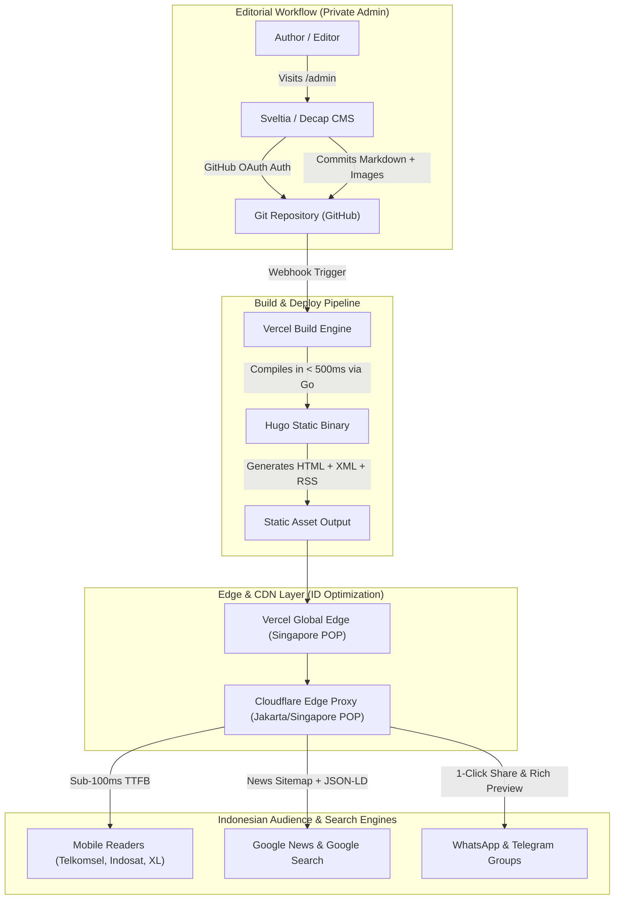

# Architecture & Implementation Plan: hotdamn.my.id

> **Domain:** [hotdamn.my.id](https://hotdamn.my.id)  
> **Niche:** Indonesian Tech & AI, Politics, National Controversies, Spicy Takes & High-Engagement Commentary  
> **Aesthetic Target:** Medium-inspired (Clean white canvas, crisp typography, distraction-free reading, not sloppy)  
> **Stack:** Hugo (Go-powered SSG) + Decap/Sveltia CMS (Private Web Admin) + Flat Markdown Database  
> **Hosting & Edge:** Cloudflare DNS (Edge Caching / DDoS / SSL) + Vercel (Automated CI/CD & Deployments)  
> **Cost:** \$0 / month (100% Free Tier, Zero Server Maintenance)

---

## 1. System Architecture Overview



---

## 2. Technology Stack Rationale

| Component | Choice | Rationale |
| :--- | :--- | :--- |
| **Generator Engine** | **Hugo (Extended, Go-based)** | Blazing fast builds (< 1ms per page), written in Go, rock-solid stability, zero runtime vulnerabilities, native Vercel build support. |
| **Content Database** | **Flat-file Markdown (`/content/posts/*.md`)** | Zero database downtime, zero SQL injection, free version control, readable and editable anywhere. |
| **Editorial CMS** | **Sveltia / Decap CMS (`/static/admin`)** | Private web-based CMS with rich text formatting, draft/publish workflow, and image upload. Direct git commits to GitHub. |
| **Hosting & CI/CD** | **Vercel (Hobby Free Tier)** | Native Git integration, instant edge deploys, Singapore edge POP, zero config SSL. |
| **DNS & Security** | **Cloudflare Free** | DNS proxy, DDoS mitigation, automatic HTTP/3, Jakarta edge cache, Web Analytics. |
| **Styling** | **Custom Tailwind CSS / Clean Semantic CSS** | Lightweight Medium-style layout, ultra-fast initial paint (LCP < 0.8s), zero bloat. |

---

## 3. SEO & GEO Master Strategy (Indonesia-First)

### 3.1. Indonesian GEO Signals
- **Domain ccTLD:** `.my.id` automatically signals Indonesian geographic intent to search engines.
- **Language Declarations:**
  - `<html lang="id">`
  - `<meta http-equiv="content-language" content="id">`
  - OpenGraph locale: `<meta property="og:locale" content="id_ID">`
- **Regional Meta:**
  - `<meta name="geo.region" content="ID">`
  - `<meta name="geo.placename" content="Indonesia">`

### 3.2. Structured Data (JSON-LD)
Every article automatically emits valid Schema.org markup:
- **`NewsArticle` / `BlogPosting`**:
  - `headline`, `description`, `datePublished`, `dateModified` (ISO 8601 with `+07:00` WIB offset)
  - `author` (Person with name, profile link)
  - `publisher` (Organization `hotdamn.my.id` with logo)
  - `image` (1200x630 high-res banner)
  - `mainEntityOfPage` canonical URL
- **`BreadcrumbList`**: For clear navigation hierarchy in Google SERP.

### 3.3. Sitemaps & Feeds
1. **Google News XML Sitemap (`/news-sitemap.xml`)**:
   - Custom Hugo layout rendering articles published within the last 48 hours.
   - Uses `<news:news>`, `<news:publication>`, `<news:publication_date>`, and `<news:title>` tags per Google News guidelines.
2. **Standard Sitemap (`/sitemap.xml`)**: Complete crawl index with priority and change frequencies.
3. **Full-Text RSS 2.0 Feed (`/index.xml`)**: For RSS aggregators, Google Discover crawlers, and newsletter syndication.

### 3.4. Indonesian Viral Sharing & Engagement
- **WhatsApp Share Button:** Direct `whatsapp://send?text=...` with auto-encoded title and short canonical link.
- **Telegram Share Button:** Direct `https://t.me/share/url?url=...`
- **X / Twitter Share Button:** Formatted with trending Indonesian hashtags (#Teknologi #Politik #Viral).
- **Automated OpenGraph Social Previews:** Crisp 1200x630 share cards formatted for WhatsApp link previews.

---

## 4. Design & UI Specifications (Medium Aesthetic)

> [!NOTE]
> Detailed design tokens, typography scale, and layout will be finalized with your design agent. The framework is built to accept custom CSS/tokens seamlessly.

### Core Visual Principles
1. **Clean White Backdrop:** Minimalist `#ffffff` background with subtle `#f9fafb` card/accent backgrounds.
2. **Editorial Typography:**
   - Headlines: Elegant, high-legibility serif or sharp modern sans (e.g. `Lora`, `Merriweather`, or `Instrument Serif` paired with `Inter`).
   - Body: Clean reader-friendly sans-serif at `18px-20px` with `1.75` line-height for effortless reading.
3. **Category Badges & Hot Takes:** Subtle pill badges for niches:
   - `AI & TECH`
   - `POLITIK`
   - `KONFLIK & DRAMA`
   - `HOT TAKE`
4. **Reading Indicators:** Estimated reading time (`X menit membaca`) and publication date in Indonesian locale (`25 September 2026`).
5. **Distraction-Free Layout:**
   - Single-column article view with max-width `720px` (optimal reading measure).
   - Sticky minimal header with brand logo and subtle category links.
   - Zero intrusive popups or third-party ads.

---

## 5. Directory & File Structure

```text
hotdamn.my.id/
├── .github/
│   └── workflows/              # Optional backup CI workflows
├── archetypes/
│   └── default.md              # Template for new articles with frontmatter
├── assets/
│   ├── css/
│   │   └── main.css            # Medium-style minimal typography & layout
│   └── js/
│       └── share.js            # Lightweight 1-click share & clipboard utilities
├── content/
│   └── posts/
│       ├── ai-di-indonesia.md  # Sample initial article (Tech/AI)
│       └── politik-panas.md    # Sample initial article (Politics/Drama)
├── layouts/
│   ├── _default/
│   │   ├── baseof.html         # Master shell with SEO, GEO, and OpenGraph tags
│   │   ├── list.html           # Homepage & category listings
│   │   └── single.html         # Article reading view (Medium style)
│   ├── partials/
│   │   ├── header.html         # Clean navbar
│   │   ├── footer.html         # Minimal footer
│   │   ├── seo.html            # All meta tags, GEO, and JSON-LD
│   │   └── share-buttons.html  # WhatsApp, Telegram, X buttons
│   ├── index.html              # Frontpage layout
│   ├── news-sitemap.xml        # Google News specific XML sitemap
│   └── sitemap.xml             # Standard sitemap template
├── static/
│   ├── admin/
│   │   ├── index.html          # Sveltia / Decap CMS admin interface
│   │   └── config.yml          # CMS fields configuration (Title, category, tags, cover)
│   ├── images/                 # Uploaded media & logos
│   ├── favicon.ico
│   └── robots.txt              # Search engine crawler instructions
├── config.toml                 # Hugo master configuration
├── vercel.json                 # Vercel routing & cache headers
└── plan.md                     # Master project blueprint
```

---

## 6. Step-by-Step Implementation Roadmap

- [ ] **Phase 1: Project Initialization & Hugo Setup**
  - Initialize Hugo site structure with native configuration (`config.toml`).
  - Configure `hotdamn.my.id` base URL, Indonesian language locale (`id-ID`), and timezone (`Asia/Jakarta`).
- [ ] **Phase 2: Private Admin Panel (`/admin`)**
  - Set up Sveltia CMS / Decap CMS at `/static/admin/index.html`.
  - Configure `/static/admin/config.yml` with article collections, categories (AI, Tech, Politik, Drama), cover image uploader, and markdown editor.
- [ ] **Phase 3: Clean Medium-Style Theme Layout**
  - Implement distraction-free single-column article template.
  - Implement clean homepage with featured stories and category feeds.
  - Structure CSS for easy adaptation once your design agent provides final visual tokens.
- [ ] **Phase 4: Full Indonesian SEO & GEO Engine**
  - Implement comprehensive OpenGraph & Twitter Card headers.
  - Implement JSON-LD `NewsArticle` schema.
  - Generate automated `news-sitemap.xml` for Google News eligibility.
  - Add 1-click WhatsApp & Telegram share integrations.
- [ ] **Phase 5: Cloudflare & Vercel Deployment Configuration**
  - Create `vercel.json` with security headers, cache policies, and clean URLs.
  - Document Cloudflare DNS settings (Proxied A/CNAME records) and SSL settings.
